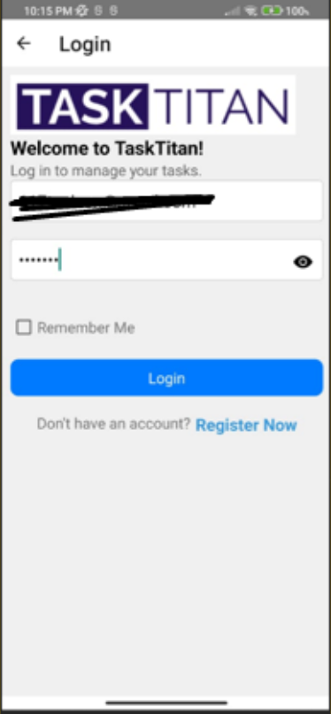
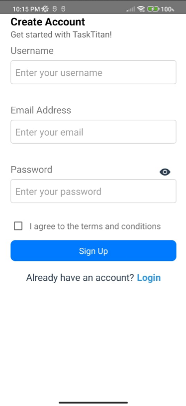

# TaskTitan

TaskTitan is an advanced task management and productivity application designed to enhance efficiency and simplify project workflows. It integrates task scheduling, note-taking, statistical insights, and the Pomodoro technique into a user-friendly platform suitable for individuals and teams across various industries.

# Technologies Used:
-	Frontend Development: Utilized Javascript using the React Native framework to create a responsive and intuitive user interface.
-	Data Management: Implemented SQLite for robust and efficient data handling.
-	Cloud Connectivity: Leveraged various APIs such as REST API, WebSocket API, and OpenWeatherMap API to enable seamless cloud integration and connectivity.

## Key Features

### User Authentication
- **Secure Login/Logout**: Ensures that user accounts are protected and access is securely managed.

### Task Management
- **Task Creation and Tracking**: Effortlessly create and track tasks with detailed attributes such as deadlines, priorities, and statuses.
- **Custom Labels and Filters**: Enhance task organization through active and completed labels and sorting based on due date and title of tasks.

### Note-Taking Functionality
- **Text Notes**: Create detailed notes linked to tasks or support basic rich text for comprehensive information capture.
- **Organizational Features**: Categorize and search notes, making it easy to manage large volumes of information.

### Statistical Insights
- **Performance Dashboard**: Provides visual statistics on tasks’ due dates and overall stats, helping users stay informed about their productivity and task completion trends.

### Pomodoro Timer
- **Focus Enhancement**: Incorporates the Pomodoro technique to encourage focused work sessions, followed by short breaks, optimizing productivity.

### Navigation Options
- **Bottom Tab Navigation**: Quick access to tasks, notes, statistics, and the Pomodoro timer, facilitating smooth transitions between different functionalities.
- **Drawer Navigation**: Provides an organized menu for additional settings and features, enhancing the overall user experience.

TaskTitan is essential for anyone looking to streamline their tasks, harness rich data insights, and improve time management through an all-encompassing platform that adapts to the evolving needs of modern users.

### Screenshots
<!-- Screenshot 1 -->

<!-- Screenshot 2 -->

<!-- Screenshot 3 -->

<!-- Screenshot 4 -->

<!-- Screenshot 5 -->

<!-- Screenshot 6 -->

<!-- Screenshot 7 -->

<!-- Screenshot 8 -->

<!-- Screenshot 9 -->

<!-- Screenshot 10 -->

<!-- Screenshot 11 -->

<!-- Screenshot 12 -->

<!-- Screenshot 13 -->

